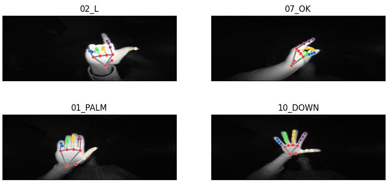

# Prodigy InfoTech Machine Learning Internship Task 4

## **Task Details**

Develop a hand gesture recognition model that can accurately identify and classify different hand gestures from image or video data.

## **Implementation**

Using this [DATASET](https://www.kaggle.com/datasets/gti-upm/leapgestrecog).

Workflow:

1. Detect hands in our images: I chose to use Google's [MediaPipe Hand Landmarker](https://developers.google.com/mediapipe/solutions/vision/hand_landmarker) which detects hands in the form of landmarks for basically every joint on our hand.

2. Detect different gestures: Collected all landmark positions for each image in the dataset and that's what I used for training. The model would learn from the relationships between certain landmarks (how far is the thumb landmark from the index landmark, are they curved, etc).

Fit my data on a RandomForestClassifier and yielded an accuracy of 99%. When tested on new data, it seems to perform pretty well.
 

